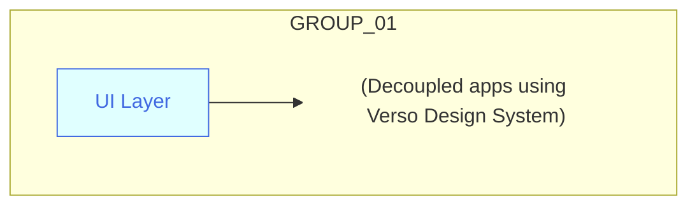

```mermaid

  flowchart TD

  classDef Button fill:lightcyan, stroke:royalblue, color:royalblue;
  classDef Note fill:transparent, stroke-width:0px
  %% ---------- ---------- ---------- ---------- ---------- ---------- ---------- ---------- ---------- ----------
  subgraph GROUP_01
    direction LR

    BUTTON_01["UI Layer"]:::Button
    click BUTTON_01 "https://en.wikipedia.org/wiki/Main_Page" _blank
    BUTTON_01_NOTE["(Decoupled apps using Verso Design System)"]:::Note

BUTTON_01-->BUTTON_01_NOTE
  end


```
