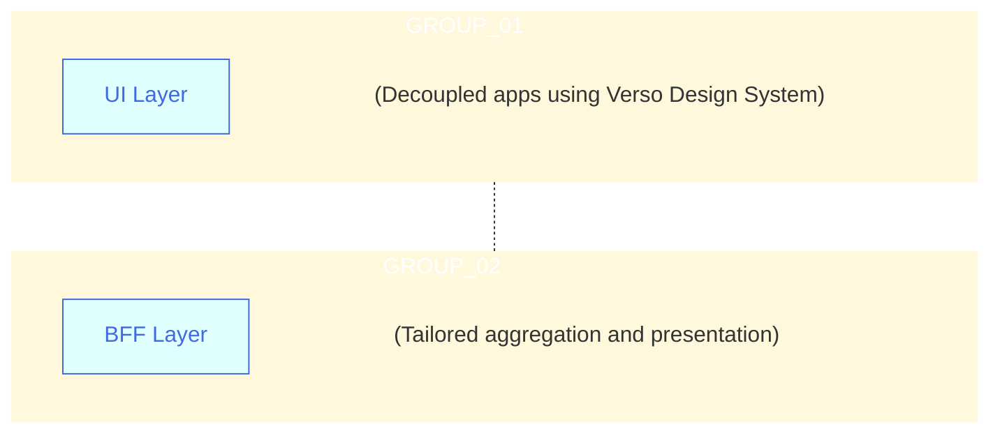

```mermaid
  %%{
    init: {
      "flowchart": { "markdownAutoWrap":"false", "textWrap":"false", "textAlign":"left", "wrappingWidth": "100%" }
    }
  }%%
  flowchart TD

  classDef Button fill:lightcyan, stroke:royalblue, color:royalblue;
  classDef Note fill:transparent, stroke-width:0px
  %% ---------- ---------- ---------- ---------- ---------- ---------- ---------- ---------- ---------- ----------
  subgraph GROUP_01
    direction LR

    BUTTON_01_NOTE["(Decoupled apps using Verso Design System)"]:::Note
    BUTTON_01["UI Layer"]:::Button
    click BUTTON_01 "https://en.wikipedia.org/wiki/Main_Page" _blank

    BUTTON_01~~~
    BUTTON_01_NOTE
  end
  %% ---------- ---------- ---------- ---------- ---------- ---------- ---------- ---------- ---------- ----------
  subgraph GROUP_02
    direction LR

    BUTTON_02_NOTE["(Tailored aggregation and presentation)"]:::Note
    BUTTON_02["BFF Layer"]:::Button
    click BUTTON_02 "https://en.wikipedia.org/wiki/Main_Page" _blank

    BUTTON_02~~~
    BUTTON_02_NOTE
  end
  %% ---------- ---------- ---------- ---------- ---------- ---------- ---------- ---------- ---------- ----------

GROUP_01-.-GROUP_02

%%BUTTON_01-->BUTTON_02

  style GROUP_01 fill:cornsilk, color:white, stroke-width:0px, width: 700px
  style GROUP_02 fill:cornsilk, color:white, stroke-width:0px, width: 700px

```
