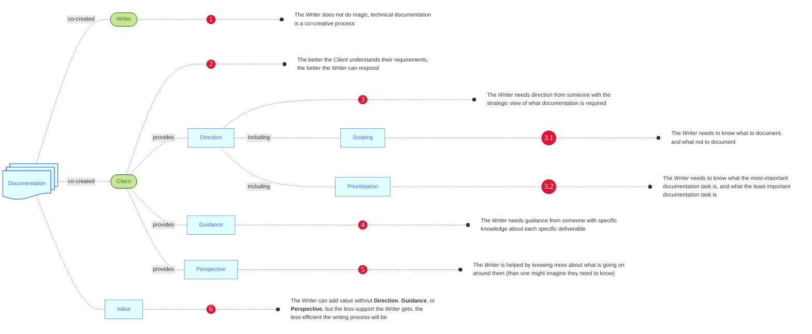

```mermaid
%%{
  init: {
    "flowchart": { "markdownAutoWrap":"false", "textWrap":"false", "wrappingWidth": "100%" }
  }
}%%
flowchart LR

  %% define styles
  classDef User fill:#cde498, stroke:forestgreen, color:forestgreen;
  classDef Number fill:crimson, color:cornsilk, stroke:firebrick, font-family:verdana, font-size:16pt, padding:10px;
  classDef Entity fill:lightcyan, stroke:royalblue, color:royalblue;

  %%classDef Note fill:transparent, stroke:white, text-align:left, font-size: 95% ;
  classDef Note fill:transparent, stroke:white, text-align:left;

  %% ---------- ---------- ---------- ---------- ---------- ---------- ---------- ---------- ---------- ----------
  DOCUMENTATION_01@{ shape: docs, label: "Documentation"}
  class DOCUMENTATION_01 Entity
  %% ---------- ---------- ---------- ---------- ---------- ---------- ---------- ---------- ---------- ----------
  1(("1")):::Number
  WRITER_01([&nbsp;Writer&nbsp;]):::User
  WRITER_01_NOTE["The <i>Writer</i> does not do magic, technical documentation<br/>is a co=creative process"]:::Note

  WRITER_01-.-
  1-.-o
  WRITER_01_NOTE
  %% ---------- ---------- ---------- ---------- ---------- ---------- ---------- ---------- ---------- ----------
  2(("2")):::Number
  CLIENT_01([&nbsp;Client&nbsp;]):::User
  CLIENT_01_NOTE["The better the <i>Client</i> understands their requirements,<br/> the better the <i>Writer</i> can respond"]:::Note

  CLIENT_01-.-
  2-.-o
  CLIENT_01_NOTE

  %% ---------- ---------- ---------- ---------- ---------- ---------- ---------- ---------- ---------- ----------
  DOCUMENTATION_01-.&nbsp;co-created&nbsp;.-
  WRITER_01

  DOCUMENTATION_01-.&nbsp;co-created&nbsp;.-
  CLIENT_01
  %% ---------- ---------- ---------- ---------- ---------- ---------- ---------- ---------- ---------- ----------
  3(("3")):::Number
  DIRECTION_01[&nbsp;Direction&nbsp;]:::Entity
  DIRECTION_01_NOTE["The <i>Writer</i> needs direction from someone with the<br/>strategic view of what documentation is required"]:::Note

  DIRECTION_01-.-
  3-.-o
  DIRECTION_01_NOTE

  CLIENT_01-.&nbsp;provides&nbsp;.-
  DIRECTION_01
  %% ---------- ---------- ---------- ---------- ---------- ---------- ---------- ---------- ---------- ----------
  3_1(("3.1")):::Number
  SCOPING_01[&nbsp;Scoping&nbsp;]:::Entity
  SCOPING_01_NOTE["The <i>Writer</i> needs to know what to document,<br/>and what not to document"]:::Note

  3_2(("3.2")):::Number
  PRIORITISATION_01[&nbsp;Prioritisation&nbsp;]:::Entity
  PRIORITISATION_01_NOTE["The <i>Writer</i> needs to know what the most-important<br/>documentation task is, and what the least-important<br/>documentation task is"]:::Note

  DIRECTION_01-.&nbsp;including&nbsp;.-
  SCOPING_01-.-
  3_1-.-o
  SCOPING_01_NOTE

  DIRECTION_01-.&nbsp;including&nbsp;.-
  PRIORITISATION_01-.-
  3_2-.-o
  PRIORITISATION_01_NOTE
  %% ---------- ---------- ---------- ---------- ---------- ---------- ---------- ---------- ---------- ----------
  4(("4")):::Number
  GUIDANCE_01[&nbsp;Guidance&nbsp;]:::Entity
  GUIDANCE_01_NOTE["The <i>Writer</i> needs guidance from someone with specific<br/>knowledge about each specific deliverable"]:::Note

  GUIDANCE_01-.-
  4-.-o
  GUIDANCE_01_NOTE

  CLIENT_01-.&nbsp;provides&nbsp;.-
  GUIDANCE_01
  %% ---------- ---------- ---------- ---------- ---------- ---------- ---------- ---------- ---------- ----------
  5(("5")):::Number
  PERSPECTIVE_01[&nbsp;Perspective&nbsp;]:::Entity
  PERSPECTIVE_01_NOTE["The <i>Writer</i> is helped by knowing more about what is going on<br/>around them (than one might imagine they need to know)"]:::Note

  PERSPECTIVE_01-.-
  5-.-o
  PERSPECTIVE_01_NOTE

  CLIENT_01-.&nbsp;provides&nbsp;.-
  PERSPECTIVE_01
  %% ---------- ---------- ---------- ---------- ---------- ---------- ---------- ---------- ---------- ----------
  6(("6")):::Number
  VALUE_01[&nbsp;Value&nbsp;]:::Entity
  VALUE_01_NOTE["The <i>Writer</i> can add value without <b>Direction</b>, <b>Guidance</b>, or<br/><b>Perspective</b>, but the less-support the <i>Writer</i> gets, the<br/>less-efficient the writing process will be"]:::Note

  VALUE_01-.-
  6-.-o
  VALUE_01_NOTE

  DOCUMENTATION_01-.-
  VALUE_01


```
