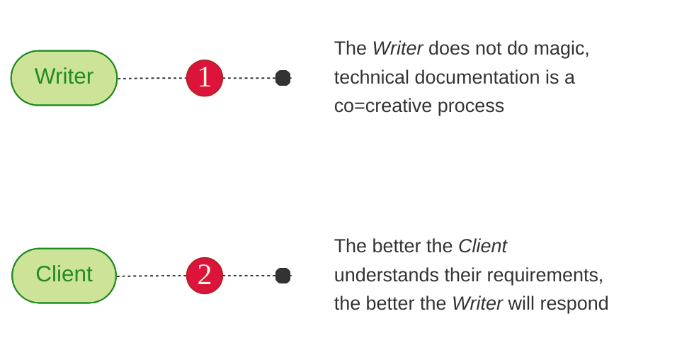

```mermaid
flowchart LR

  %% define styles
  classDef User fill:#cde498, stroke:forestgreen, color:forestgreen;
  classDef Number fill:crimson, color:cornsilk, stroke:firebrick, font-family:verdana, font-size:16pt, padding:10px;
  classDef Button fill:green, color:white;
  classDef Note fill:transparent, stroke:white, text-align:left, font-size: 95%;

  classDef Backend fill:mediumseagreen, stroke:white, color:honeydew;
  classDef Entity fill:lightcyan, stroke:royalblue, color:royalblue;
  
  %% ---------- ---------- ---------- ---------- ---------- ---------- ---------- ---------- ---------- ----------
  1(("1")):::Number
  WRITER_01([&nbsp;Writer&nbsp;]):::User
  WRITER_01_NOTE["The <i>Writer</i> does not do magic, technical documentation is a co=creative process"]:::Note

  WRITER_01-.-
  1-.-o
  WRITER_01_NOTE
  %% ---------- ---------- ---------- ---------- ---------- ---------- ---------- ---------- ---------- ----------
  2(("2")):::Number
  CLIENT_01([&nbsp;Client&nbsp;]):::User
  CLIENT_01_NOTE["The better the <i>Client</i> understands their requirements, the better the <i>Writer</i> will respond"]:::Note

  CLIENT_01-.-
  2-.-o
  CLIENT_01_NOTE


```
