## Mesopotamia
At some point in time, our ancestors began moving about the landscape less and dragging all 'their stuff' with them when they went. That appears to have happened first in Mesopotamia, when Northern Europe was still deep in the Ice Age about ten-to-fifteen thousand years ago (but don't quote me on that). If you'd thought about the name a little, you would likely have realised that _meso_ means _between_, and that _pot_ likely has the same meaning that it has in _potable_ - and - that would be a good guess. Mesopotamia, rather than being a country (in any sense of the word) is the name applied to the geographical area between, and surrounding the
[Tigris](https://en.wikipedia.org/wiki/Tigris) and [Euphrates](https://en.wikipedia.org/wiki/Euphrates).

```mermaid
%%{
  init: {
    'theme': 'forest',
    'themeVariables': {
      'fontSize':'9pt'

    }
  }
}%%


flowchart LR
%%classDef Note_b fill:cornsilk, stroke:saddlebrown, color:saddlebrown, text-align:left, margin:0px, padding:0px, height:40px;
%%classDef Note fill:cornsilk, stroke:saddlebrown, color:saddlebrown, text-align:left, line-height:150%, margin:0px, padding:0px;
%%classDef Period fill:linen, stroke:darkred, color:darkred;
classDef Note fill:cornsilk, stroke:saddlebrown, color:saddlebrown, line-height:150%, margin:0px, padding:0px;
classDef Summary fill:white, stroke:white, text-align:left

      KEY_YEARS(("Key Years"))

      13000([from ~ 13000 BCE])
      NATUFIAN[Natufian Culture]
      click NATUFIAN "https://en.wikipedia.org/wiki/Natufian_culture" _blank

      10000([from ~ 10,000 BCE])
      PRE_POTTERY_NEOLITHIC_A[Pre-Pottery Neolithic A]
      click PRE_POTTERY_NEOLITHIC_A "https://en.wikipedia.org/wiki/Pre-Pottery_Neolithic_A" _blank

      9500([from ~ 9,500 BCE])
      GOBEKLI_TEPE[Göbekli Tepe]
      click GOBEKLI_TEPE "https://en.wikipedia.org/wiki/Göbekli_Tepe" _blank

      7500([from ~ 7,500 BCE])
      CATALHOYUK[Çatalhöyük]
      CATALHOYUK_NOTE[#151; the earliest known town-like human settlement, where hundreds of people lived in a cluster of mudbrick houses.]
      click CATALHOYUK "https://en.wikipedia.org/wiki/Çatalhöyük" _blank

      7000([from ~ 7,000 BCE])
      POTTERY_NEOLITHIC[Pottery Neolithic]

      6400([from ~ 6,400 BCE])
      YARNUKIAN[Yarmukian Culture]
      click YARNUKIAN "https://en.wikipedia.org/wiki/Yarmukian_culture" _blank

      6100([from ~ 6,100 BCE])
      HALAF[Halaf Culture]
      click HALAF "https://en.wikipedia.org/wiki/Halaf_culture" _blank

      5500([from ~ 5,500 BCE])
            UBAID[Ubaid Period]
            click UBAID "https://en.wikipedia.org/wiki/Ubaid_period" _blank
            SUMER[Sumer]
            SUMER_NOTE[#151; the earliest known civilization in southern Mesopotamia, and where Cuneiform was invented.]
            click SUMER "https://en.wikipedia.org/wiki/Sumer" _blank

      5400([from ~ 5,400 BCE])
      ERIDU[Eridu]
      click ERIDU "https://en.wikipedia.org/wiki/Eridu" _blank

      4000([from ~ 4,000 BCE])
            URUK_PERIOD[Uruk Period]
            click URUK_PERIOD "https://en.wikipedia.org/wiki/Uruk_period" _blank

            URUK[Uruk]
            URUK_NOTE[#151; city founded ~ 5,000 BCE]
            click URUK "https://en.wikipedia.org/wiki/Uruk" _blank

            INANNA[Inanna]
            INANNA_NOTE[#151; the patron goddess of the Eanna temple in Uruk]
            click INANNA "https://en.wikipedia.org/wiki/Inanna" _blank

            GILGAMESH[Gilgamesh]
            GILGAMESH_NOTE[#151; from ~ 2,900, the king of Uruk]
            click GILGAMESH "https://en.wikipedia.org/wiki/Gilgamesh" _blank

      3100([from ~ 3,100 BCE])
            CUNEIFORM[Cuneiform]
            CUNEIFORM_NOTE["#151; the earliest know writing system (invented by the Sumerians)"]
            click CUNEIFORM "https://en.wikipedia.org/wiki/Cuneiform" _blank


      class NATUFIAN,PRE_POTTERY_NEOLITHIC_A,GOBEKLI_TEPE,CATALHOYUK,POTTERY_NEOLITHIC,YARNUKIAN,HALAF,UBAID,SUMER,ERIDU,URUK_PERIOD,URUK,INANNA,GILGAMESH,CUNEIFORM Note;
      class CATALHOYUK_NOTE,SUMER_NOTE,URUK_NOTE,INANNA_NOTE,CUNEIFORM_NOTE,GILGAMESH_NOTE Summary
      %% ========== ========== ========== ========== ==========

      %% ========== ========== ========== ========== ==========
      KEY_YEARS-.-13000-.-NATUFIAN
      KEY_YEARS-.-10000-.-PRE_POTTERY_NEOLITHIC_A
      KEY_YEARS-.-9500-.-GOBEKLI_TEPE
      KEY_YEARS-.-7500-.-CATALHOYUK~~~CATALHOYUK_NOTE
      KEY_YEARS-.-7000-.-POTTERY_NEOLITHIC
      KEY_YEARS-.-6400-.-YARNUKIAN
      KEY_YEARS-.-6100-.-HALAF
      KEY_YEARS-.-5500-.-UBAID
                  5500-.-SUMER~~~SUMER_NOTE
      KEY_YEARS-.-5400-.-ERIDU

      KEY_YEARS-.-4000-.-URUK_PERIOD
                  4000-.-URUK~~~URUK_NOTE
                         URUK-.-INANNA~~~INANNA_NOTE
                         URUK-.-GILGAMESH~~~GILGAMESH_NOTE

      KEY_YEARS-.-3100-.-CUNEIFORM~~~CUNEIFORM_NOTE

      %% ========== ========== ========== ========== ==========
      2900([from ~ 2,900 BCE])
            EARLY_DYNASTIC_PERIOD(Early Dynastic Period)
            click EARLY_DYNASTIC_PERIOD "https://en.wikipedia.org/wiki/Early_Dynastic_Period_(Mesopotamia)" _blank
            EARLY_DYNASTIC_PERIOD_NOTE[#151; characterized by the existence of many city-states]

            ASSUR_01[Aššur]
            ASSUR_01_NOTE[#151; the founding of]


      %%2600([from ~ 2,600 BCE])
            %%EARLY_ASSYRIAN_PERIOD[Early Assyrian Period]
            %%click EARLY_ASSYRIAN_PERIOD "https://en.wikipedia.org/wiki/Early_Assyrian_period" _blank

      2334([from ~ 2,334 BCE])
            SARGON_OF_AKKAD[Sargon of Akkad]
            SARGON_OF_AKKAD_NOTE[#151; the first ruler of the Akkadian Empire, known for his conquests of the Sumerian city-states]
            AKKADIAN_EMPIRE[Akkadian Empire]
            AKKAD[Akkad]
            AKKAD_NOTE["#151; the capital city of the Akkadian Empire (location unknown)"]
            click AKKADIAN_EMPIRE "https://en.wikipedia.org/wiki/Akkadian_Empire" _blank

      2100([from ~ 2,100 BCE])
            ASSYRIA[Assyria]
            ASSYRIA_NOTE[#151; a major civilization of northern Mesopotamia]
            click ASSYRIA "https://en.wikipedia.org/wiki/Assyria" _blank

            ASSUR_02[Aššur]
            ASSUR_02_NOTE[#151; from ~ 2,025 BCE, the capital of the Assyrian city-state]
            click ASSUR_02 "https://en.wikipedia.org/wiki/Assur" _blank

      %%2025([from ~ 2,025 BCE])
            %%ASSUR[Aššur]
            %%ASSUR_NOTE[#151; by then, the capital of the Assyrian city-state]
            %%click ASSUR "https://en.wikipedia.org/wiki/Assur" _blank


      %% ---------- ---------- ---------- ---------- ---------- ---------- ----------

      class EARLY_ASSYRIAN_PERIOD,SARGON_OF_AKKAD,AKKADIAN_EMPIRE,AKKAD,ASSYRIA,ASSUR_01,ASSUR_02,ASSUR Note;
      class SARGON_OF_AKKAD_NOTE,AKKAD_NOTE,ASSYRIA_NOTE,ASSUR_NOTE,EARLY_DYNASTIC_PERIOD_NOTE,ASSUR_01_NOTE,ASSUR_02_NOTE Summary

      class EARLY_DYNASTIC_PERIOD Note;
      class EARLY_DYNASTIC_PERIOD Period;
      %% ---------- ---------- ---------- ---------- ---------- ---------- ----------
      KEY_YEARS-.-2900-.-EARLY_DYNASTIC_PERIOD~~~EARLY_DYNASTIC_PERIOD_NOTE
                         EARLY_DYNASTIC_PERIOD---ASSUR_01~~~ASSUR_01_NOTE


      %%KEY_YEARS-.-2600-.-EARLY_ASSYRIAN_PERIOD
      KEY_YEARS-.-2334-.-SARGON_OF_AKKAD~~~SARGON_OF_AKKAD_NOTE
                  2334-.-AKKADIAN_EMPIRE
                         AKKADIAN_EMPIRE~~~AKKAD~~~AKKAD_NOTE
      KEY_YEARS-.-2100-.-ASSYRIA~~~ASSYRIA_NOTE
                         ASSYRIA-.-ASSUR_02~~~ASSUR_02_NOTE

      %%KEY_YEARS-.-2025-.-ASSUR~~~ASSUR_NOTE

      %% ========== ========== ========== ========== ==========

```

