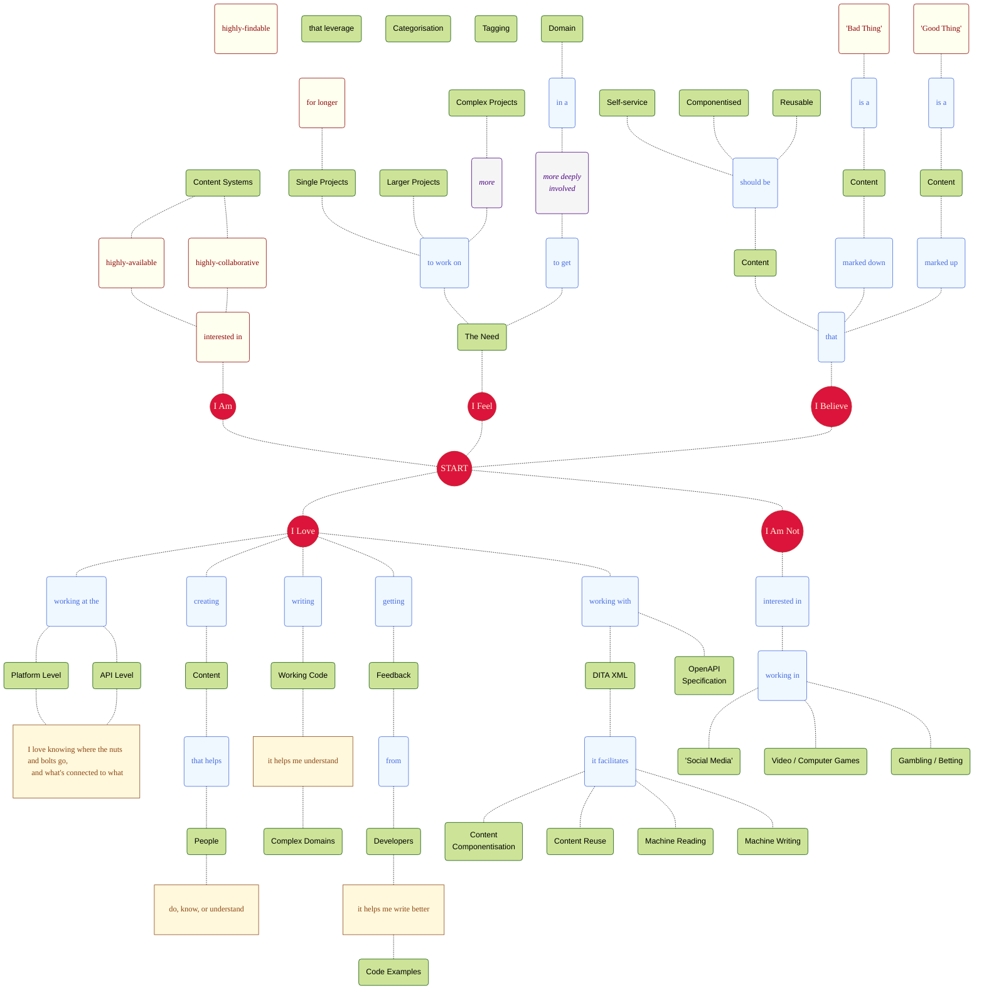

```mermaid
%%{init: { "theme":"forest" } }%%
flowchart TD
  classDef Start fill:crimson, color:cornsilk, stroke:firebrick, font-family:verdana, font-size:14pt, padding:10px;

  classDef Verb fill:aliceblue, color:royalblue, stroke:royalblue, font-family:verdana, padding:0px 4px;
  classDef Adverb fill:whitesmoke, color:indigo, stroke:indigo, font-family:verdana, font-style:italic, padding:0px 4px;
  classDef Adjective fill:ivory, color:darkred, stroke:darkred, font-family:verdana, padding:0px 4px;
  classDef Note fill:cornsilk, stroke:saddlebrown, color:saddlebrown, font-family:verdana, text-align:left, padding:0px 4px;

  %% ========== ========== ========== ========== ==========
  I_AM(("I Am")):::Start
  I_AM-.-START

  INTERESTED_IN("interested in")
  HIGHLY_AVAILABLE("highly-available")
  HIGHLY_FINDABLE("highly-findable")
  HIGHLY_COLABORATIVE("highly-collaborative")
  CONTENT_SYSTEMS("Content Systems")
  THAT_LEVERAGE("that leverage")
  CATEGORISATION("Categorisation")
  TAGGING("Tagging")

  class INTERESTED_IN,HIGHLY_AVAILABLE,HIGHLY_FINDABLE,HIGHLY_COLABORATIVE Adjective;

  CONTENT_SYSTEMS-.-HIGHLY_AVAILABLE-.-INTERESTED_IN
  %%CONTENT_SYSTEMS-.-HIGHLY_FINDABLE-.-INTERESTED_IN
  CONTENT_SYSTEMS-.-HIGHLY_COLABORATIVE-.-INTERESTED_IN

  INTERESTED_IN-.-I_AM
  %% ========== ========== ========== ========== ==========
  SINGLE_PROJECTS("Single Projects")
  LARGER_PROJECTS("Larger Projects")
  COMPLEX_PROJECTS("Complex Projects")
  DOMAIN("Domain")

  TO_WORK_ON("to work on")
  FOR_LONGER("for longer")
  TO_GET("to get")
  %%INVOLVED("involved")
  IN_A("in a")

  MORE("more")
  %%MORE_DEEPLY("more deeply")
  MORE_DEEPLY_INVOLVED("more deeply<br/>involved")

  class TO_WORK_ON,TO_GET,IN_A Verb;
  class MORE,MORE_DEEPLY_INVOLVED Adverb;
  class FOR_LONGER,INVOLVED Adjective;

  %%WORK_ON("work on")
  %%MORE_TIME("More Time")
  %%WORKING_ON("working on")

  %%TO_SPEND_1("to spend")

  %%LONGER_TERM_ROLES("Longer-term Roles")

  THE_NEED("The Need")
  I_FEEL(("I Feel")):::Start


  FOR_LONGER-.-SINGLE_PROJECTS-.-TO_WORK_ON-.-THE_NEED-.-I_FEEL
  LARGER_PROJECTS-.-TO_WORK_ON
  COMPLEX_PROJECTS-.-MORE-.-TO_WORK_ON

  DOMAIN-.-IN_A-.-MORE_DEEPLY_INVOLVED-.-TO_GET-.-THE_NEED

  %%I_FEEL-.-I_BELIEVE
  %% ----------

  SELF_SERVICE("Self-service")
  COMPONENTISED("Componentised")
  REUSABLE("Reusable")

  CONTENT_1("Content")

  SHOULD_BE_1("should be")
  THAT_1("that")

  I_BELIEVE(("I Believe")):::Start

  class SHOULD_BE_1,THAT_1 Verb;

  SELF_SERVICE-.-SHOULD_BE_1-.-CONTENT_1-.-THAT_1-.-I_BELIEVE
  COMPONENTISED-.-SHOULD_BE_1
  REUSABLE-.-SHOULD_BE_1

  %% ---------- ---------- ---------- ---------- ----------
  BAD_THING("'Bad Thing'")
  IS_A_1("is a")
  CONTENT_2("Content")
  MARKED_DOWN("marked down")

  GOOD_THING("'Good Thing'")
  IS_A_2("is a")
  CONTENT_3("Content")
  MARKED_UP("marked up")

  class GOOD_THING,BAD_THING Adjective;

  BAD_THING-.-IS_A_1-.-CONTENT_2-.-MARKED_DOWN-.-THAT_1
  GOOD_THING-.-IS_A_2-.-CONTENT_3-.-MARKED_UP-.-THAT_1

  class MARKED_DOWN,IS_A_1,MARKED_UP,IS_A_2 Verb;
  %% ========== ========== ========== ========== ==========
  I_LOVE(("I Love")):::Start

  %%I_BELIEVE-.-I_LOVE
  %%  ========== ========== ========== ========== ==========
  WORKING_AT_THE("working at the")
  PLATFORM_LEVEL("Platform Level")
  API_LEVEL("API Level")
  LOVE_KNOWING_NUTS_AND_BOLTS["I love knowing where the nuts and bolts go,<br/>&ensp;and what's connected to what"]

  class WORKING_AT_THE Verb;
  class LOVE_KNOWING_NUTS_AND_BOLTS Note;

  I_LOVE-.-
  WORKING_AT_THE-.-PLATFORM_LEVEL-.-LOVE_KNOWING_NUTS_AND_BOLTS
  WORKING_AT_THE-.-API_LEVEL-.-LOVE_KNOWING_NUTS_AND_BOLTS
  %% ---------- ---------- ---------- ---------- ----------
  CREATING("creating")
  CONTENT_4("Content")
  THAT_HELPS("that helps")
  PEOPLE("People")
  DO_KNOW_UNDERSTAND["do, know, or understand"]

  class CREATING,THAT_HELPS Verb;
  class DO_KNOW_UNDERSTAND Note;

  I_LOVE-.-CREATING-.-CONTENT_4-.-THAT_HELPS-.-PEOPLE-.-DO_KNOW_UNDERSTAND
  %% ---------- ---------- ---------- ---------- ----------
  WRITING("writing")
  WORKING_CODE("Working Code")
  HELPS_ME_UNDERSTAND["it helps me understand"]
  COMPLEX_DOMAINS("Complex Domains")

  class WRITING Verb;
  class HELPS_ME_UNDERSTAND Note;

  I_LOVE-.-WRITING-.-WORKING_CODE-.-HELPS_ME_UNDERSTAND-.-COMPLEX_DOMAINS
  %% ---------- ---------- ---------- ---------- ----------
  GETTING("getting")
  FEEDBACK("Feedback")
  FROM("from")
  DEVELOPERS("Developers")
  HELPS_ME_WRITE_BETTER[it helps me write better]
  CODE_EXAMPLES("Code Examples")

  class GETTING,FROM Verb;
  class HELPS_ME_WRITE_BETTER Note;

  I_LOVE-.-GETTING-.-FEEDBACK-.-FROM-.-DEVELOPERS-.-HELPS_ME_WRITE_BETTER-.-CODE_EXAMPLES
  %% ---------- ---------- ---------- ---------- ----------
  WORKING_WITH("working with")
  DITA_XML("DITA XML")
  IT_FACILITATES("it facilitates")
  CONTENT_COMPONENTISATION("Content<br/>Componentisation")
  CONTENT_REUSE("Content Reuse")
  MACHINE_READING("Machine Reading")
  MACHINE_WRITING("Machine Writing")

  class WORKING_WITH,IT_FACILITATES Verb;

  I_LOVE-.-WORKING_WITH-.-DITA_XML-.-
  IT_FACILITATES-.-CONTENT_COMPONENTISATION
  IT_FACILITATES-.-CONTENT_REUSE
  IT_FACILITATES-.-MACHINE_READING
  IT_FACILITATES-.-MACHINE_WRITING

  WORKING_WITH-.-
  OPEN_API_SPECIFICATION("OpenAPI<br/>Specification")
  %%  ========== ========== ========== ========== ==========
  %%ID_LIKE_TO(("I'd Like To")):::Start
  %%TRANSITION("Transition")

  %%ID_LIKE_TO-.-TRANSITION


  %%  ========== ========== ========== ========== ==========
  IM_NOT(("I Am Not")):::Start

  INTERESTED_IN_2("interested in")
  WORKING_IN("working in")

  class INTERESTED_IN_2,WORKING_IN Verb;

  SOCIAL_MEDIA("'Social Media'")
  VIDEO_COMPUTER_GAMES("Video / Computer Games")
  GAMBLING_BETTING("Gambling / Betting")

  IM_NOT-.-INTERESTED_IN_2-.-
  WORKING_IN-.-SOCIAL_MEDIA
  WORKING_IN-.-VIDEO_COMPUTER_GAMES
  WORKING_IN-.-GAMBLING_BETTING

  %% ========== ========== ========== ========== ==========
  I_AM(("I Am")):::Start
  INTERESTED_IN("interested in")

  %%  ========== ========== ========== ========== ==========
  START(("START")):::Start

  %%I_AM-.-START

  I_FEEL-.-START
  I_BELIEVE-.-START

  START-.-I_LOVE
  START-.-IM_NOT
```

