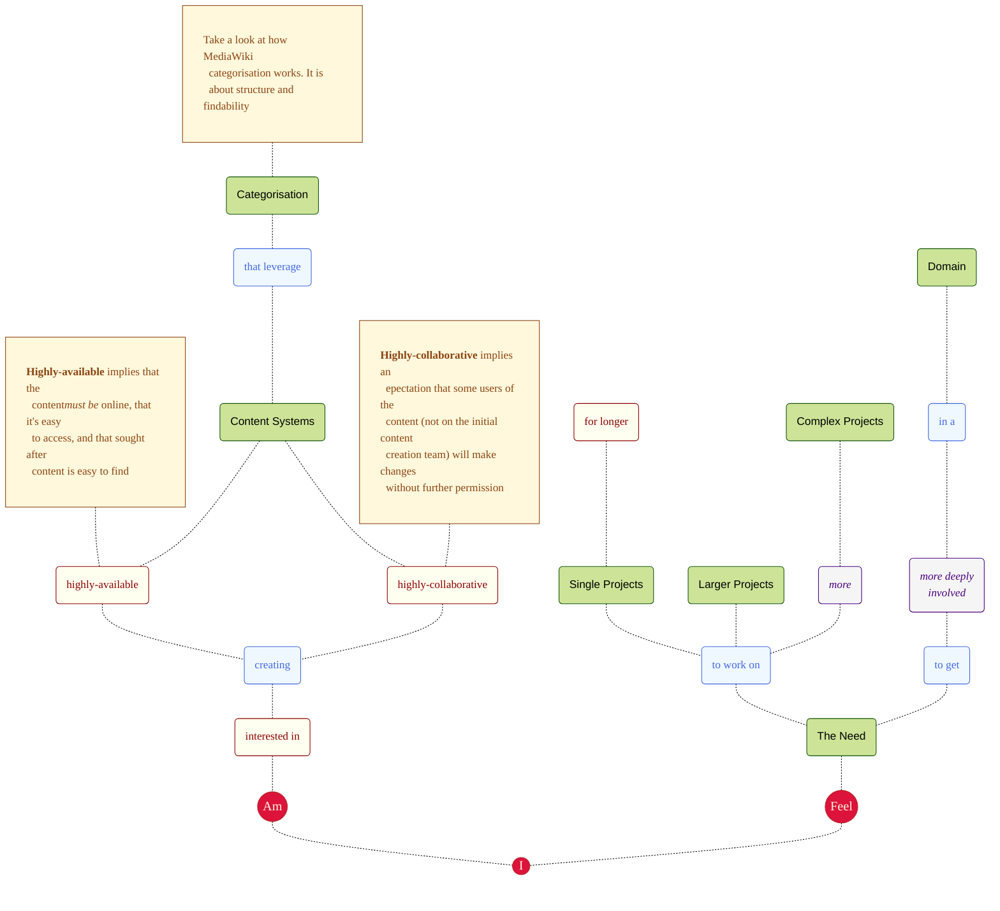

```mermaid
%%{init: { "theme":"forest" } }%%
flowchart TD
  classDef Start fill:crimson, color:cornsilk, stroke:firebrick, font-family:verdana, font-size:14pt, padding:10px;
  classDef Verb fill:aliceblue, color:royalblue, stroke:royalblue, font-family:verdana;
  classDef Adverb fill:whitesmoke, color:indigo, stroke:indigo, font-family:verdana, font-style:italic;
  classDef Adjective fill:ivory, color:darkred, stroke:darkred, font-family:verdana, line-height:18pt;
  classDef Note fill:cornsilk, stroke:saddlebrown, color:saddlebrown, font-family:verdana, text-align:left, margin:8px;


  %% ========== ========== ========== ========== ==========
  I(("I")):::Start
  %% ========== ========== ========== ========== ==========
  AM(("Am")):::Start

  CATEGORISATION_NOTE["Take a look at how MediaWiki&ensp;<br/>&ensp;categorisation works. It is<br/>&ensp;about structure and findability"]
  HIGHLY_AVAILABLE_NOTE["<b>Highly-available</b> implies that the<br/>&ensp;content<i>must be</i> online, that it's easy<br/>&ensp;to access, and that sought after<br/>&ensp;content is easy to find"]  
  HIGHLY_COLABORATIVE_NOTE["<b>Highly-collaborative</b> implies an<br/>&ensp;epectation that some users of the<br/>&ensp;content (not on the initial content<br/>&ensp;creation team) will make changes<br/>&ensp;without further permission"]

  class CATEGORISATION_NOTE,HIGHLY_AVAILABLE_NOTE,HIGHLY_COLABORATIVE_NOTE Note;

  CATEGORISATION("Categorisation")
  THAT_LEVERAGE("that leverage")
  CONTENT_SYSTEMS("Content Systems")
  HIGHLY_AVAILABLE("highly-available")
  HIGHLY_COLABORATIVE("highly-collaborative")
  CREATING_1("creating")
  INTERESTED_IN("interested in")

  class INTERESTED_IN,HIGHLY_AVAILABLE,HIGHLY_COLABORATIVE Adjective;
  class CREATING_1,THAT_LEVERAGE Verb;

  CATEGORISATION_NOTE-.-
  CATEGORISATION-.-
  THAT_LEVERAGE-.-
  CONTENT_SYSTEMS

  HIGHLY_AVAILABLE_NOTE-.-HIGHLY_AVAILABLE
  CONTENT_SYSTEMS-.-HIGHLY_AVAILABLE
  CONTENT_SYSTEMS-.-HIGHLY_COLABORATIVE
  HIGHLY_COLABORATIVE_NOTE-.-HIGHLY_COLABORATIVE

  HIGHLY_AVAILABLE-.-CREATING_1
  HIGHLY_COLABORATIVE-.-CREATING_1

  CREATING_1-.-
  INTERESTED_IN-.-
  AM-.-
  I
  %% ========== ========== ========== ========== ==========
  FEEL(("Feel")):::Start

  DOMAIN("Domain")
  FOR_LONGER("for longer")
  COMPLEX_PROJECTS("Complex Projects")
  IN_A("in a")

  SINGLE_PROJECTS("Single Projects")
  LARGER_PROJECTS("Larger Projects")
  MORE("more")
  MORE_DEEPLY_INVOLVED("more deeply<br/>involved")

  TO_WORK_ON("to work on")
  FOR_LONGER("for longer")
  TO_WORK_ON("to work on")
  TO_GET("to get")
  THE_NEED("The Need")

  class TO_WORK_ON,TO_GET,IN_A Verb;
  class MORE,MORE_DEEPLY_INVOLVED Adverb;
  class FOR_LONGER,INVOLVED Adjective;

  FOR_LONGER-.-SINGLE_PROJECTS-.-TO_WORK_ON
  LARGER_PROJECTS-.-TO_WORK_ON
  COMPLEX_PROJECTS-.-MORE-.-TO_WORK_ON

  TO_WORK_ON-.-THE_NEED
  DOMAIN-.-IN_A-.-MORE_DEEPLY_INVOLVED-.-TO_GET-.-THE_NEED

  THE_NEED-.-
  FEEL-.-
  I
```
