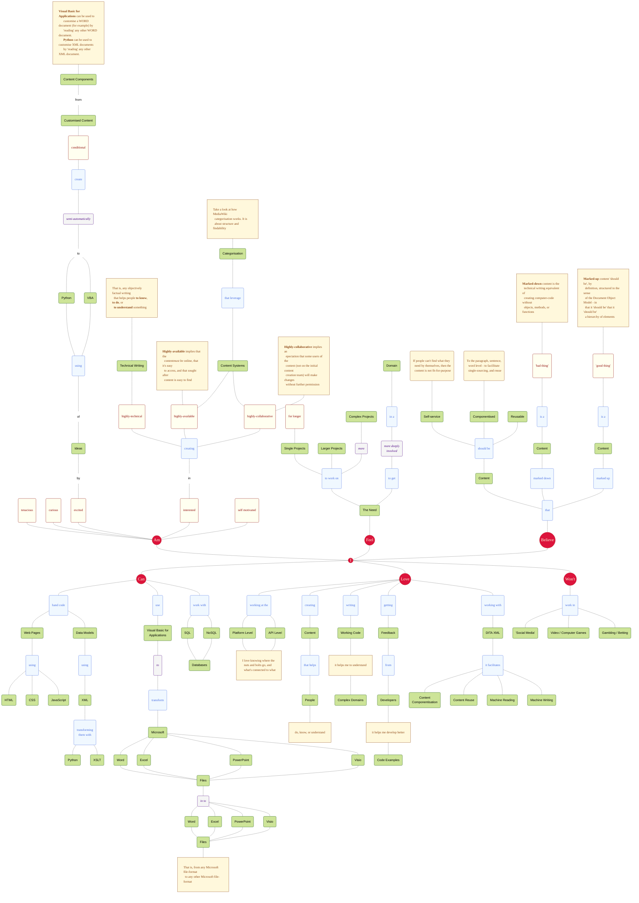

The main purpose of this mindmap is for me to map out (for myself) my thinking about my skills, knowledge, and the
nature of the work I want to do in the future.

```mermaid
%%{init: { "theme":"forest" } }%%
flowchart TD
  classDef Start fill:crimson, color:cornsilk, stroke:firebrick, font-family:verdana, font-size:16pt, padding:10px;
  classDef Verb fill:aliceblue, color:royalblue, stroke:royalblue, font-family:verdana, padding:10px;
  classDef Adverb fill:whitesmoke, color:indigo, stroke:indigo, font-family:verdana, font-style:italic;
  classDef Adjective fill:ivory, color:darkred, stroke:darkred, font-family:verdana, line-height:190%, padding:10px;
  classDef Other fill:transparent, stroke:transparent;
  classDef Note fill:cornsilk, stroke:saddlebrown, color:saddlebrown, font-family:verdana, text-align:left, margin:8px;

  %% ========== ========== ========== ========== ========== ========== ========== ========== ========== ==========
  I(("I")):::Start
  %% ========== ========== ========== ========== ========== ========== ========== ========== ========== ==========
  AM(("Am")):::Start
  AM-.-I
  %% ========== ========== ========== ========== ========== ========== ========== ========== ========== ==========
  CURIOUS_1("curious")
  CONDITIONAL_1("conditional")

  EXCITED_1("excited")
  INTERESTED_1("interested")
  SELF_MOTIVATED_1("self motivated")
  TENACIOUS_1("tenacious")
  
  class CURIOUS_1,CONDITIONAL_1 Adjective;

  class TENACIOUS_1,EXCITED_1,INTERESTED_1,SELF_MOTIVATED_1 Adjective;


  %% ---------- ---------- ---------- ---------- ---------- ---------- ---------- ---------- ---------- ----------
  by_1("by")
  FROM_1("from")
  IN_1("in")
  OF_1("of")
  TO_1("to")
  TO_2("to")

  class by_1 Other;
  class FROM_1 Other;
  class IN_1 Other;
  class OF_1 Other;
  class TO_1,TO_2 Other;
  %% ---------- ---------- ---------- ---------- ---------- ---------- ---------- ---------- ---------- ----------
  USING_1
  USING_2
  USING_3("using")
  class USING_1,USING_2,USING_3 Verb

  CREATING_1("creating")
  %%CREATING_2("creating")

  class CREATING_1,CREATING_2,TO_CREATE_1 Verb;

  CREATE_1("create")
  class CREATE_1 Verb;

  SEMI_AUTOMATICALLY("semi-automatically")

  class SEMI_AUTOMATICALLY Adverb

  %% ========== ========== ========== ========== ========== ========== ========== ========== ========== ==========
  TENACIOUS_1-.-AM
  %% ========== ========== ========== ========== ========== ========== ========== ========== ========== ==========
  CURIOUS_1-.-AM
  %% ========== ========== ========== ========== ========== ========== ========== ========== ========== ==========
  EXCITED_1-.-AM

  CONTENT_COMPONENTS_NOTE["
    <b>Visual Basic for Applications</b> can be used to
    &ensp;customise a WORD document (for example) by
    &ensp;'reading' any other WORD document.
    &ensp;<b>Python</b> can be used to customise XML documents
    &ensp;by 'reading' any other XML document.
  "]

  class CONTENT_COMPONENTS_NOTE Note
  %% ---------- ---------- ---------- ---------- ---------- ---------- ---------- ---------- ---------- ----------
  IDEAS_1("Ideas")


  PYTHON_2("Python")
  VBA_1("VBA")
  CUSTOMISED_CONTENT("Customised Content")
  CONTENT_COMPONENTS("Content Components")

  %%CONTENT_COMPONENTS_NOTE-.-
  %%CONTENT_COMPONENTS-.-FROM_1-.-SEMI_AUTOMATICALLY-.-CUSTOMISED_CONTENT-.-CONDITIONAL_1-.-TO_CREATE_1

  CONTENT_COMPONENTS_NOTE-.-
  CONTENT_COMPONENTS-.-FROM_1-.-CUSTOMISED_CONTENT-.-CONDITIONAL_1-.-CREATE_1-.-SEMI_AUTOMATICALLY-.-TO_2

  TO_2-.-PYTHON_2  
  TO_2-.-VBA_1

  PYTHON_2-.-USING_3
  VBA_1-.-USING_3

  %%USING_3-.-OF_1-.-IDEAS_1-.-by_1-.-EXCITED_1-.-AM
  USING_3-.-OF_1-.-IDEAS_1-.-by_1-.-EXCITED_1
  %% ========== ========== ========== ========== ========== ========== ========== ========== ========== ==========
  TECHNICAL_WRITING_NOTE["That is, any objectively factual writing<br/>&ensp;that helps people <b>to know</b>, <b>to do</b>, or<br/>&ensp;<b>to understand</b> something"]

  TECHNICAL_WRITING("Technical Writing")
  HIGHLY_TECHNICAL("highly-technical")


  class TECHNICAL_WRITING_NOTE Note;
  class HIGHLY_TECHNICAL Adjective;

  TECHNICAL_WRITING_NOTE-.-TECHNICAL_WRITING-.-HIGHLY_TECHNICAL-.-CREATING_1
  %% ========== ========== ========== ========== ========== ========== ========== ========== ========== ==========
  CATEGORISATION_NOTE["Take a look at how MediaWiki&ensp;<br/>&ensp;categorisation works. It is<br/>&ensp;about structure and findability"]
  HIGHLY_AVAILABLE_NOTE["<b>Highly-available</b> implies that the<br/>&ensp;content<i>must be</i> online, that it's easy<br/>&ensp;to access, and that sought after<br/>&ensp;content is easy to find"]  
  HIGHLY_COLABORATIVE_NOTE["<b>Highly-collaborative</b> implies an<br/>&ensp;epectation that some users of the<br/>&ensp;content (not on the initial content<br/>&ensp;creation team) will make changes<br/>&ensp;without further permission"]

  class CATEGORISATION_NOTE,HIGHLY_AVAILABLE_NOTE,HIGHLY_COLABORATIVE_NOTE Note;

  CATEGORISATION("Categorisation")
  THAT_LEVERAGE("that leverage")
  CONTENT_SYSTEMS("Content Systems")
  HIGHLY_AVAILABLE("highly-available")
  HIGHLY_COLABORATIVE("highly-collaborative")
  %%CREATING_1("creating")
  %%INTERESTED_IN("interested in")

  class HIGHLY_AVAILABLE,HIGHLY_COLABORATIVE Adjective;
  class THAT_LEVERAGE Verb;

  CATEGORISATION_NOTE-.-
  CATEGORISATION-.-
  THAT_LEVERAGE-.-
  CONTENT_SYSTEMS

  HIGHLY_AVAILABLE_NOTE-.-HIGHLY_AVAILABLE
  CONTENT_SYSTEMS-.-HIGHLY_AVAILABLE
  CONTENT_SYSTEMS-.-HIGHLY_COLABORATIVE
  HIGHLY_COLABORATIVE_NOTE-.-HIGHLY_COLABORATIVE

  HIGHLY_AVAILABLE-.-CREATING_1
  HIGHLY_COLABORATIVE-.-CREATING_1

  CREATING_1-.-
  IN_1-.-
  INTERESTED_1-.-
  AM
  %% ========== ========== ========== ========== ========== ========== ========== ========== ========== ==========
  %% SELF MOTIVATED

  SELF_MOTIVATED_1-.-AM
  %% ========== ========== ========== ========== ========== ========== ========== ========== ========== ==========

  FEEL(("Feel")):::Start

  DOMAIN("Domain")
  FOR_LONGER("for longer")
  COMPLEX_PROJECTS("Complex Projects")
  IN_A("in a")

  SINGLE_PROJECTS("Single Projects")
  LARGER_PROJECTS("Larger Projects")
  MORE("more")
  MORE_DEEPLY_INVOLVED("more deeply<br/>involved")

  TO_WORK_ON("to work on")
  FOR_LONGER("for longer")
  TO_WORK_ON("to work on")
  TO_GET("to get")
  THE_NEED("The Need")

  class TO_WORK_ON,TO_GET,IN_A Verb;
  class MORE,MORE_DEEPLY_INVOLVED Adverb;
  class FOR_LONGER,INVOLVED Adjective;

  FOR_LONGER-.-SINGLE_PROJECTS-.-TO_WORK_ON
  LARGER_PROJECTS-.-TO_WORK_ON
  COMPLEX_PROJECTS-.-MORE-.-TO_WORK_ON

  TO_WORK_ON-.-THE_NEED
  DOMAIN-.-IN_A-.-MORE_DEEPLY_INVOLVED-.-TO_GET-.-THE_NEED

  THE_NEED-.-
  FEEL-.-I
  %% ========== ========== ========== ========== ========== ========== ========== ========== ========== ==========
  BELIEVE(("Believe")):::Start

  SELF_SERVICE_NOTE("If people can't find what they<br/>&ensp;need by themselves, then the<br/>&ensp;content is not fit-for-purpose")
  COMPONENTISED_NOTE("To the paragraph, sentence,<br/>&ensp;word level - to facillitate<br/>&ensp;single-sourcing, and reuse")
  MARKED_DOWN_CONTENT_NOTE["<b>Marked-down</b> content is the<br/>&ensp;technical writing equivalent of<br/>&ensp;creating computer-code without<br/>&ensp;objects, methods, or functions"]
  MARKED_UP_CONTENT_NOTE["<b>Marked-up</b> content 'should be', by<br/>&ensp;definition, structured in the sense<br/>&ensp;of the Document Object Model - in<br/>&ensp;that it 'should be' that it 'should be'<br/>&ensp;a hierarchy of elements"]

  class SELF_SERVICE_NOTE,COMPONENTISED_NOTE,MARKED_DOWN_CONTENT_NOTE,MARKED_UP_CONTENT_NOTE Note;

  SELF_SERVICE("Self-service")
  COMPONENTISED("Componentised")
  REUSABLE("Reusable")
  SHOULD_BE_1("should be")
  CONTENT_1("Content")
  THAT_1("that")

  class SHOULD_BE_1,THAT_1 Verb;

  SELF_SERVICE_NOTE-.-SELF_SERVICE-.-SHOULD_BE_1
  COMPONENTISED_NOTE-.-COMPONENTISED-.-SHOULD_BE_1
  REUSABLE-.-SHOULD_BE_1

  SHOULD_BE_1-.-CONTENT_1-.-THAT_1

  %% ---------- ---------- ---------- ---------- ---------- ---------- ---------- ---------- ---------- ----------
  BAD_THING("'bad thing'")
  IS_A_1("is a")
  MARKED_DOWN_CONTENT("Content")
  MARKED_DOWN("marked down")

  GOOD_THING("'good thing'")
  IS_A_2("is a")
  MARKED_UP_CONTENT("Content")
  MARKED_UP("marked up")

  class GOOD_THING,BAD_THING Adjective;
  class MARKED_DOWN,IS_A_1,MARKED_UP,IS_A_2 Verb;

  MARKED_DOWN_CONTENT_NOTE-.-BAD_THING-.-IS_A_1-.-MARKED_DOWN_CONTENT-.-MARKED_DOWN-.-THAT_1
  MARKED_UP_CONTENT_NOTE-.-GOOD_THING-.-IS_A_2-.-MARKED_UP_CONTENT-.-MARKED_UP-.-THAT_1
  %% ---------- ---------- ---------- ---------- ---------- ---------- ---------- ---------- ---------- ----------
  THAT_1-.-BELIEVE-.-I
  %% ========== ========== ========== ========== ========== ========== ========== ========== ========== ==========
  CAN(("Can")):::Start

  HAND_CODE("hand code")
  WEB_PAGES("Web Pages")
  USING_1("using")
  HTML("HTML")
  CSS("CSS")
  JAVASCRIPT("JavaScript")

  DATA_MODELS("Data Models")
  USING_2("using")
  XML("XML")
  TRANSFORMING_THEM_WITH("transforming<br/>them with")
  PYTHON("Python")
  XSLT("XSLT")


  class HAND_CODE,USING_1,USING_2,TRANSFORMING_THEM_WITH Verb;

  I-.-
  CAN-.-
  %% ---------- ---------- ---------- ---------- ---------- ---------- ---------- ---------- ---------- ----------
  HAND_CODE-.-
  WEB_PAGES-.-
  USING_1

  USING_1-.-HTML
  USING_1-.-CSS
  USING_1-.-JAVASCRIPT
  %% ---------- ---------- ---------- ---------- ---------- ---------- ---------- ---------- ---------- ----------
  HAND_CODE-.-
  DATA_MODELS-.-
  USING_2-.-
  XML-.-
  TRANSFORMING_THEM_WITH

  TRANSFORMING_THEM_WITH-.-PYTHON
  TRANSFORMING_THEM_WITH-.-XSLT
  %% ---------- ---------- ---------- ---------- ---------- ---------- ---------- ---------- ---------- ----------
  WORK_WITH_1("work with")
  SQL("SQL")
  NOSQL("NoSQL")
  DATABASES("Databases")

  class WORK_WITH_1 Verb;

  CAN-.-WORK_WITH_1
  WORK_WITH_1-.-SQL-.-DATABASES
  WORK_WITH_1-.-NOSQL-.-DATABASES
  %% ---------- ---------- ---------- ---------- ---------- ---------- ---------- ---------- ---------- ----------
  FILES_NOTE["That is, from any Microsoft file-format<br/>&ensp;to any other Microsoft file-format"]

  USE_1("use")
  VBA("Visual Basic for<br/>Applications")
  TO_1("to")
  TRANSFORM_1("transform")
  MICROSOFT_1("Microsoft")

  DOCX_1("Word")
  EXCEL_1("Excel")
  POWERPOINT_1("PowerPoint")
  VISIO_1("Visio")
  FILES_1("Files")
  IN_TO_1("in to")

  DOCX_2("Word")
  EXCEL_2("Excel")
  POWERPOINT_2("PowerPoint")
  VISIO_2("Visio")
  FILES_2("Files")

  class USE_1,TO_1,TRANSFORM_1 Verb;
  class TO_1,IN_TO_1 Adverb;
  class FILES_NOTE Note;

  CAN-.-USE_1-.-VBA-.-TO_1-.-TRANSFORM_1

  TRANSFORM_1-.-MICROSOFT_1

  MICROSOFT_1-.-DOCX_1-.-FILES_1
  MICROSOFT_1-.-EXCEL_1-.-FILES_1
  MICROSOFT_1-.-POWERPOINT_1-.-FILES_1
  MICROSOFT_1-.-VISIO_1-.-FILES_1

  FILES_1-.-IN_TO_1

  IN_TO_1-.-DOCX_2-.-FILES_2
  IN_TO_1-.-EXCEL_2-.-FILES_2
  IN_TO_1-.-POWERPOINT_2-.-FILES_2
  IN_TO_1-.-VISIO_2-.-FILES_2

  FILES_2-.-FILES_NOTE

  %% ========== ========== ========== ========== ========== ========== ========== ========== ========== ==========
  LOVE(("Love")):::Start
  I-.-LOVE

  PLATFORM_LEVEL_NOTE["I love knowing where the<br/>&ensp;nuts and bolts go, and<br/>&ensp;what's connected to what"]

  WORKING_AT_THE("working at the")
  PLATFORM_LEVEL("Platform Level")
  API_LEVEL("API Level")

  class WORKING_AT_THE Verb;
  class PLATFORM_LEVEL_NOTE Note;

  LOVE-.-
  WORKING_AT_THE-.-PLATFORM_LEVEL-.-PLATFORM_LEVEL_NOTE
  WORKING_AT_THE-.-API_LEVEL-.-PLATFORM_LEVEL_NOTE
  %% ---------- ---------- ---------- ---------- ---------- ---------- ---------- ---------- ---------- ----------
  DO_KNOW_UNDERSTAND_NOTE["do, know, or understand"]

  CREATING("creating")
  CONTENT_4("Content")
  THAT_HELPS("that helps")
  PEOPLE("People")

  class CREATING,THAT_HELPS Verb;
  class DO_KNOW_UNDERSTAND_NOTE Note;

  LOVE-.-CREATING-.-CONTENT_4-.-THAT_HELPS-.-PEOPLE-.-DO_KNOW_UNDERSTAND_NOTE
  %% ---------- ---------- ---------- ---------- ---------- ---------- ---------- ---------- ---------- ----------
  HELPS_ME_UNDERSTAND_NOTE["it helps me to understand"]

  WRITING("writing")
  WORKING_CODE("Working Code")
  COMPLEX_DOMAINS("Complex Domains")

  class WRITING Verb;
  class HELPS_ME_UNDERSTAND_NOTE Note;

  LOVE-.-WRITING-.-WORKING_CODE-.-HELPS_ME_UNDERSTAND_NOTE-.-COMPLEX_DOMAINS
  %% ---------- ---------- ---------- ---------- ---------- ---------- ---------- ---------- ---------- ----------
  HELPS_ME_WRITE_BETTER_NOTE[it helps me develop better]

  GETTING("getting")
  FEEDBACK("Feedback")
  FROM("from")
  DEVELOPERS("Developers")

  CODE_EXAMPLES("Code Examples")

  class GETTING,FROM Verb;
  class HELPS_ME_WRITE_BETTER_NOTE Note;

  LOVE-.-GETTING-.-FEEDBACK-.-FROM-.-DEVELOPERS-.-HELPS_ME_WRITE_BETTER_NOTE-.-CODE_EXAMPLES
  %% ---------- ---------- ---------- ---------- ---------- ---------- ---------- ---------- ---------- ----------
  WORKING_WITH("working with")
  DITA_XML("DITA XML")
  IT_FACILITATES("it facilitates")
  CONTENT_COMPONENTISATION("Content<br/>Componentisation")
  CONTENT_REUSE("Content Reuse")
  MACHINE_READING("Machine Reading")
  MACHINE_WRITING("Machine Writing")

  class WORKING_WITH,IT_FACILITATES Verb;

  LOVE-.-WORKING_WITH-.-DITA_XML-.-IT_FACILITATES

  IT_FACILITATES-.-CONTENT_COMPONENTISATION
  IT_FACILITATES-.-CONTENT_REUSE
  IT_FACILITATES-.-MACHINE_READING
  IT_FACILITATES-.-MACHINE_WRITING
  %% ---------- ---------- ---------- ---------- ---------- ---------- ---------- ---------- ---------- ----------

  %% ========== ========== ========== ========== ========== ========== ========== ========== ========== ==========
  WONT(("Won't")):::Start
  I-.-WONT

  WORK_IN("work in")
  SOCIAL_MEDIA("'Social Media'")
  VIDEO_COMPUTER_GAMES("Video / Computer Games")
  GAMBLING_BETTING("Gambling / Betting")

  class WORK_IN Verb;

  WONT-.-WORK_IN

  WORK_IN-.-SOCIAL_MEDIA
  WORK_IN-.-VIDEO_COMPUTER_GAMES
  WORK_IN-.-GAMBLING_BETTING
```
