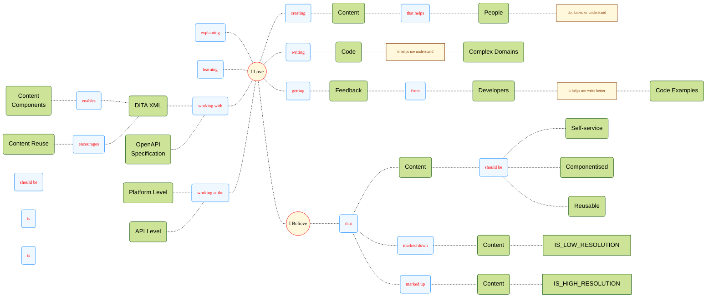

```mermaid
%%{init: { "theme":"forest"} }%%
flowchart LR
  classDef Compact font-family:verdana, font-size:7.5pt, text-align:left;
  classDef Variables fill:white, stroke:white, font-family:courier new, font-size:10pt;
  classDef Object fill:white, stroke:white, font-family:verdana, font-size:9pt;

  classDef Start fill:cornsilk, stroke:red, font-family:verdana, font-size:10pt;

  classDef Verb fill:aliceblue, color:red, stroke:dodgerblue, font-family:verdana, font-size:9pt;

I_LOVE(("I Love")):::Start
I_BELIEVE(("I Believe")):::Start

CODE("Code")
DITA_XML("DITA XML")
CODE_EXAMPLES("Code Examples")

SELF_SERVICE("Self-service")
COMPONENTISED("Componentised")
REUSABLE("Reusable")

CONTENT("Content")
CONTENT_2("Content")

CONTENT_COMPONENTS("Content<br/>Components")
CONTENT_REUSE("Content Reuse")
DEVELOPERS("Developers")
FEEDBACK("Feedback")
OPEN_API_SPECIFICATION("OpenAPI<br/>Specification")
PEOPLE("People")


PLATFORM_LEVEL("Platform Level")
API_LEVEL("API Level")


COMPLEX_DOMAINS("Complex Domains")
%% DOING ==========

CREATING("creating")
ENABLES("enables")
ENCOURAGES("encourages")
EXPLAINING("explaining")
GETTING("getting")
FROM("from")
LEARNING("learning")

SHOULD_BE("should be")
SHOULD_BE_2("should be")
THAT("that")

WORKING_AT_THE("working at the")
WORKING_WITH("working with")
WRITING("writing")

THAT_HELPS("that helps")

class CREATING,ENABLES,ENCOURAGES,EXPLAINING,GETTING,FROM,LEARNING,SHOULD_BE,SHOULD_BE_2,THAT,WORKING_AT_THE,WORKING_WITH,WRITING,THAT_HELPS Verb;


%% NOTES ==========
classDef Note fill:cornsilk, stroke:saddlebrown, color:saddlebrown, font-family:verdana, font-size:8pt, text-align:left;

DO_KNOW_UNDERSTAND["do, know, or understand"]
HELPS_ME_UNDERSTAND["it helps me understand"]

HELPS_ME_WRITE_BETTER[it helps me write better]


class DO_KNOW_UNDERSTAND,HELPS_ME_UNDERSTAND,HELPS_ME_WRITE_BETTER Note;
%% CONNECTING ==========

EXPLAINING-.-I_LOVE
LEARNING-.-I_LOVE

CONTENT_COMPONENTS-.-
ENABLES-.-
DITA_XML

CONTENT_REUSE-.-
ENCOURAGES-.-
DITA_XML-.-WORKING_WITH

OPEN_API_SPECIFICATION-.-
WORKING_WITH-.-I_LOVE

API_LEVEL-.-WORKING_AT_THE
PLATFORM_LEVEL-.-WORKING_AT_THE-.-I_LOVE

I_LOVE-.-CREATING-.-CONTENT-.-THAT_HELPS-.-PEOPLE-.-DO_KNOW_UNDERSTAND

I_LOVE-.-WRITING-.-CODE-.-HELPS_ME_UNDERSTAND-.-COMPLEX_DOMAINS

I_LOVE-.-GETTING-.-FEEDBACK-.-FROM-.-DEVELOPERS-.-HELPS_ME_WRITE_BETTER-.-CODE_EXAMPLES

I_LOVE-.-I_BELIEVE

I_BELIEVE-.-THAT-.-CONTENT_2-.-SHOULD_BE-.-SELF_SERVICE
SHOULD_BE-.-COMPONENTISED
SHOULD_BE-.-REUSABLE

%% ---------- ---------- ---------- ---------- ----------
MARKED_DOWN("marked down")
CONTENT_3("Content")
IS_1("is")
MARKED_UP("marked up")
CONTENT_4("Content")
IS_2("is")

THAT-.-
MARKED_DOWN-.-CONTENT_3-.-IS_LOW_RESOLUTION
THAT-.-
MARKED_UP-.-CONTENT_4-.-IS_HIGH_RESOLUTION

class MARKED_DOWN,IS_1,MARKED_UP,IS_2 Verb;
```

