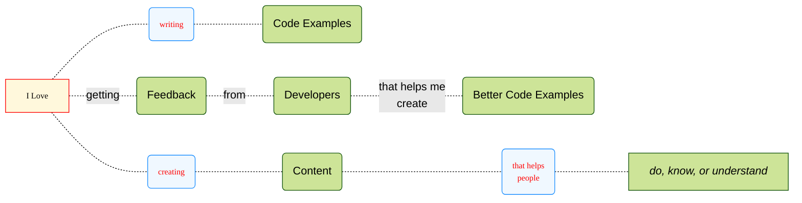
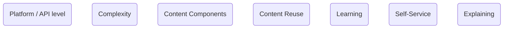

```mermaid
%%{init: { "theme":"forest"} }%%
flowchart LR
  classDef Compact font-family:verdana, font-size:7.5pt, text-align:left;
  classDef Variables fill:white, stroke:white, font-family:courier new, font-size:10pt;
  classDef Object fill:white, stroke:white, font-family:verdana, font-size:9pt;

  classDef Start fill:cornsilk, stroke:red, font-family:verdana, font-size:9pt;

  classDef Verb fill:aliceblue, color:red, stroke:dodgerblue, font-family:verdana, font-size:9pt;


I_LOVE["I Love"]:::Start


CODE_EXAMPLES("Code Examples")
BETTER_CODE_EXAMPLES("Better Code Examples")


CONTENT("Content")


DEVELOPERS("Developers")


FEEDBACK("Feedback")


DO_KNOW_UNDERSTAND["`*do, know, or understand*`"]
style DO_KNOW_UNDERSTAND text-align:left


%% DOING ==========

CREATING("creating")
WRITING("writing")

THAT_HELPS_PEOPLE("that helps
  people")

class CREATING,WRITING,THAT_HELPS_PEOPLE Verb;

%% CONNECTING ==========

I_LOVE-.-CREATING-.-CONTENT-.-THAT_HELPS_PEOPLE-.-DO_KNOW_UNDERSTAND

I_LOVE-.-WRITING-.-CODE_EXAMPLES


I_LOVE-.getting.-FEEDBACK-.from.-DEVELOPERS-.that helps me
  create.-BETTER_CODE_EXAMPLES

```

```mermaid
flowchart
PLATFORM_API("Platform / API level")
COMPLEXITY("Complexity")
CONTENT_COMPONENTS("Content Components")
CONTENT_REUSE("Content Reuse")

LEARNING("Learning")
SELF_SERVICE("Self-Service")
EXPLAINING("Explaining")

%%I_LOVE-."working at the".-PLATFORM_API
%%I_LOVE-.-COMPLEXITY
%%I_LOVE-.-LEARNING
%%I_LOVE-.-EXPLAINING
```
