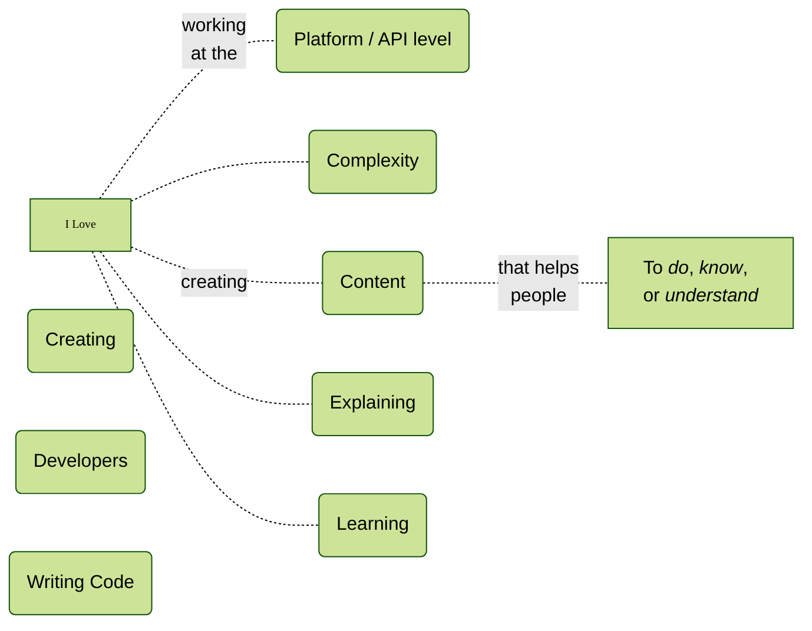

```mermaid
  %%{init: { "theme":"forest"} }%%


flowchart LR
  classDef Compact font-family:verdana, font-size:7.5pt, text-align:left;
I_LOVE["I Love"]:::Compact

PLATFORM_API("Platform / API level")

COMPLEXITY("Complexity")
CREATING("Creating")
CONTENT("Content")
DEVELOPERS("Developers")
EXPLAINING("Explaining")
LEARNING("Learning")

DO_KNOW_UNDERSTAND["`To *do*, *know*,
or *understand*`"]
style DO_KNOW_UNDERSTAND text-align:left

WRITING_CODE("Writing Code")

%% CONNECTIONS

I_LOVE-."working
at the".-PLATFORM_API

I_LOVE-.-COMPLEXITY
I_LOVE-.-LEARNING
I_LOVE-.-EXPLAINING

I_LOVE-.creating.-CONTENT-."that helps
people".-DO_KNOW_UNDERSTAND
```
