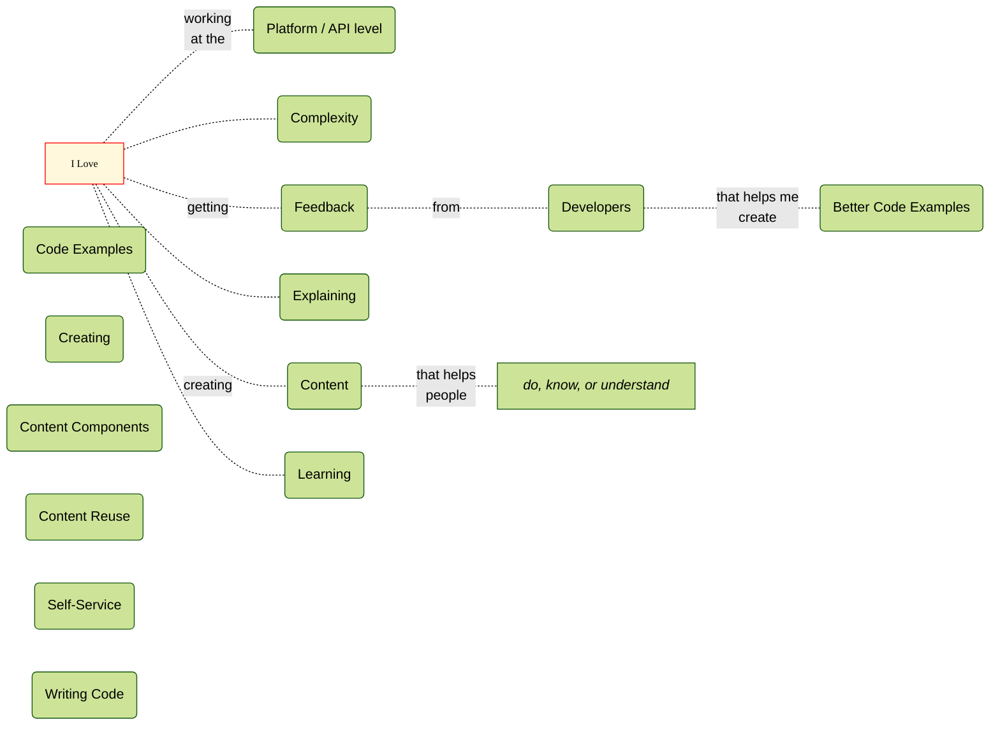

```mermaid
%%{init: { "theme":"forest"} }%%
flowchart LR
  classDef Compact font-family:verdana, font-size:7.5pt, text-align:left;
  classDef Variables fill:white, stroke:white, font-family:courier new, font-size:10pt;
  classDef Object fill:white, stroke:white, font-family:verdana, font-size:9pt;

  classDef Start fill:cornsilk, stroke:red, font-family:verdana, font-size:9pt;

I_LOVE["I Love"]:::Start

PLATFORM_API("Platform / API level")

CODE_EXAMPLES("Code Examples")
BETTER_CODE_EXAMPLES("Better Code Examples")

COMPLEXITY("Complexity")
CREATING("Creating")
CONTENT("Content")
CONTENT_COMPONENTS("Content Components")
CONTENT_REUSE("Content Reuse")

DEVELOPERS("Developers")
EXPLAINING("Explaining")

FEEDBACK("Feedback")

LEARNING("Learning")
SELF_SERVICE("Self-Service")

DO_KNOW_UNDERSTAND["`*do, know, or understand*`"]
style DO_KNOW_UNDERSTAND text-align:left

WRITING_CODE("Writing Code")

%% CONNECTIONS

I_LOVE-."working
at the".-PLATFORM_API

I_LOVE-.-COMPLEXITY
I_LOVE-.-LEARNING
I_LOVE-.-EXPLAINING

I_LOVE-.creating.-CONTENT-."that helps
people".-DO_KNOW_UNDERSTAND

I_LOVE-.getting.-FEEDBACK-.from.-DEVELOPERS-.that helps me
  create.-BETTER_CODE_EXAMPLES

```
