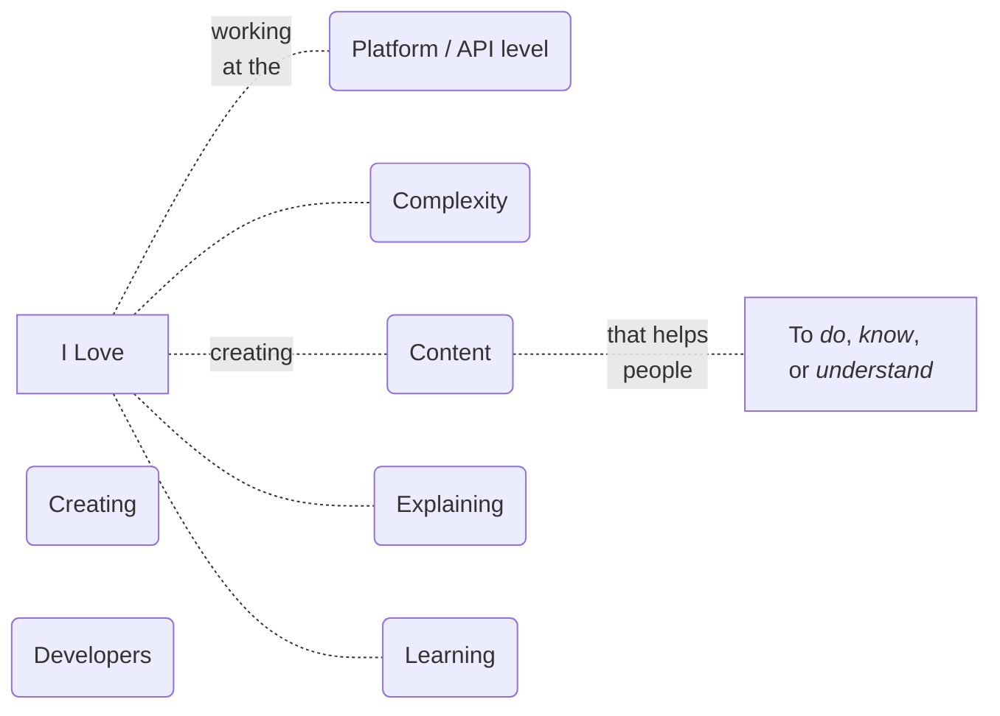

```mermaid
flowchart LR
I_LOVE["I Love"]

PLATFORM_API("Platform / API level")

COMPLEXITY("Complexity")
CREATING("Creating")
CONTENT("Content")
DEVELOPERS("Developers")
EXPLAINING("Explaining")
LEARNING("Learning")

DO_KNOW_UNDERSTAND["`To *do*, *know*,
or *understand*`"]
style DO_KNOW_UNDERSTAND text-align:left


%% CONNECTIONS

I_LOVE-."working
at the".-PLATFORM_API

I_LOVE-.-COMPLEXITY
I_LOVE-.-LEARNING
I_LOVE-.-EXPLAINING

I_LOVE-.creating.-CONTENT-."that helps
people".-DO_KNOW_UNDERSTAND
```
